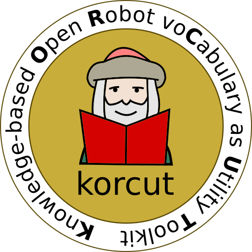

# Kastro (a Korcut ontology to support ASTROnauts in extraterrestrial environments)
The kastro ontology has been developed for the task of modelling and reasoning about prior and static knowledge about the context of the robot to assist the astronaut for MMI missions, as well as dynamic and temporally varying knowledge of agents and tools.

# korcut

The korcut (Knowledge-based Open Robot voCabulary as Utility Toolkit) provides support for system developers in the field of robotics to cover the knowledge gaps in the interdisciplinary work of electrical, mechanical and software system developers as well other fields and also user for the hardware-related areas.
This work was performed as a dissertation within the frame of the projects [Recupare-Reha](https://robotik.dfki-bremen.de/en/research/projects/recupera-reha.html), [D-Rock](https://robotik.dfki-bremen.de/en/research/projects/d-rock.html), [Q-Rock](https://robotik.dfki-bremen.de/en/research/projects/q-rock.html) at [Robotics Innovation Center](https://robotik.dfki-bremen.de/en/startpage.html) of [the German Research Center for Artificial Intelligence (DFKI)](/www.dfki.de) in Bremen, Germany.

The related publication and also the other publications from my work can be found under my publication list on <a href="https://www.dfki.de/web/ueber-uns/mitarbeiter/person/meyu01/"> DFKI Webpage </a>

This work is registered under

## General description of korcut ontology family

Korcut ontology has been developed to support mechatronical robot design.

### Design and development steps of Korcut ontology family:
The information about the design and development steps of korcut ontology family can be accessed by clicking the following link.

[Documentation of Korcut ontology family](./documentation/korcut_development.md)

## Getting Started

[//]: <> (TODO simple usage example)

## Requirements / Dependencies

* OwlReady2 is necessary to parse and modify the ontologies and reason them with Hermit or Pellet reasoner as open or closed world. Please install it on your Python first.
   * [OwlReady2 on bitbucket](https://bitbucket.org/jibalamy/owlready2/src/master/)
   * Due to the import problem with the sub ontologies please use the development version(Vers 0.26)
      * git clone https://bitbucket.org/jibalamy/owlready2.git
      * Hint: In general, you need to be sure with your [multiple Python versions and install](https://stackoverflow.com/questions/2812520/dealing-with-multiple-python-versions-and-pip) and use the correct Python in Blender
         * python3.6 -m pip install ~/work/owlready2

      * [Do not install the Owlready2 directly form PyPi.Org for the current the version! See above!](https://pypi.org/project/Owlready2/)
         * pip install Owlready2
   * [The forum of Owlready](http://owlready.8326.n8.nabble.com)
   * [Documentation](https://pythonhosted.org/Owlready2/#)

## Installation

[//]: <> (TODO how can I install this software?)

## Documentation

[//]: <> (TODO complete documentation, a link to it, or instructions that tell the user how to build it)

## Testing

[//]: <> (TODO document how to run the tests)

## Deployment

[//]: <> (TODO document how to deploy the software)

## Current State

[//]: <> (TODO is it actively developed?)

## Bug Reports

To search for bugs or report them, please use GitHubs issue tracker at:

[//]: <> (TODO put a link to the issue tracker here)

## Referencing

[//]: <> (TODO preferred way of referencing this software, e.g., use publication ...)

## Releases

[//]: <> (TODO release guidelines)

[//]: <> (TODO describe the versioning approach, for example:)

### Semantic Versioning [seeAlso](https://semver.org/)
Within the version number format MAJOR.MINOR.PATCHi is this work semantic versioned,
which help the user to understand the changes performed.

## Contacts:
* Mehmed Yüksel <mehmed.yueksel@dfki.de>

## Maintainer / Authors / Contributers

* [Mehmed Yüksel](https://orcid.org/0000-0001-8422-5773)
* [Thomas Röhr](thomas.roehr@dfki.de)
* [Marko Jankovic](https://orcid.org/0000-0002-9904-7241)
* [Mohammad Mohammadzadeh Babr]()

## Copyrights
[//]:  <> (  This work -excluding the figures- is licensed under a <a rel="license" href="http://creativecommons.org/licenses/by-nc-nd/4.0/">Creative Commons Attribution-NonCommercial-NoDerivatives 4.0 International License</a>. All figures are copyrighted.)
All rights reserved.

Copyright &copy; 2021, Mehmed Yüksel DFKI GmbH / Robotics Innovation Center

Redistribution and use in source and binary forms, with or without modification, are permitted provided that the following conditions are met:

1. Redistributions of source code must retain the above copyright notice, this list of conditions and the following disclaimer.

2. Redistributions in binary form must reproduce the above copyright notice, this list of conditions and the following disclaimer in the documentation and/or other materials provided with the distribution.

3. Neither the name of the copyright holder nor the names of its contributors may be used to endorse or promote products derived from this software without specific prior written permission.

[//]: <> (if the software is a result of a cooperation of the DFKI  RIC and the Robotics Research Group.)

### Legal Notice:
THIS SOFTWARE IS PROVIDED BY THE COPYRIGHT HOLDERS AND CONTRIBUTORS "AS IS" AND ANY EXPRESS OR IMPLIED WARRANTIES, INCLUDING, BUT NOT LIMITED TO, THE IMPLIED WARRANTIES OF MERCHANTABILITY AND FITNESS FOR A PARTICULAR PURPOSE ARE DISCLAIMED. IN NO EVENT SHALL THE COPYRIGHT HOLDER OR CONTRIBUTORS BE LIABLE FOR ANY DIRECT, INDIRECT, INCIDENTAL, SPECIAL, EXEMPLARY, OR CONSEQUENTIAL DAMAGES (INCLUDING, BUT NOT LIMITED TO, PROCUREMENT OF SUBSTITUTE GOODS OR SERVICES; LOSS OF USE, DATA, OR PROFITS; OR BUSINESS INTERRUPTION) HOWEVER CAUSED AND ON ANY THEORY OF LIABILITY, WHETHER IN CONTRACT, STRICT LIABILITY, OR TORT (INCLUDING NEGLIGENCE OR OTHERWISE) ARISING IN ANY WAY OUT OF THE USE OF THIS SOFTWARE, EVEN IF ADVISED OF THE POSSIBILITY OF SUCH DAMAGE.
